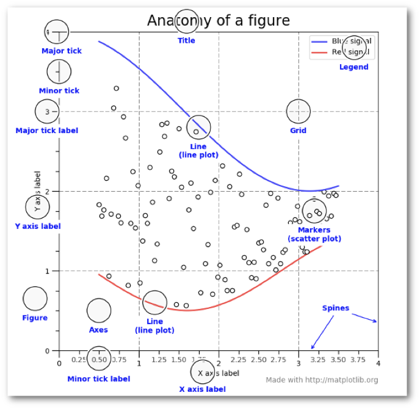
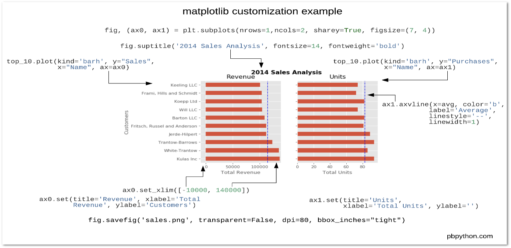
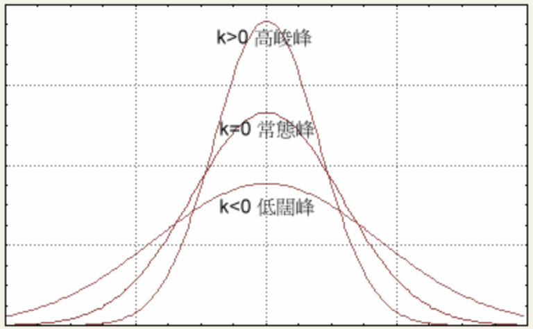
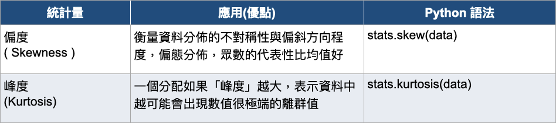
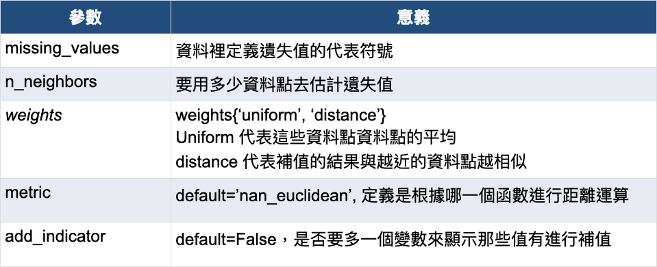

# 第一屆《Python 資料科學程式馬拉松》

- **Numpy**
    - [Day 1 : NumPy 基本操作](#day-1--numpy-基本操作)
    - [Day 2 : NumPy 陣列進階操作](#day-2--numpy-陣列進階操作)
        - [陣列重塑](#陣列重塑)
        - [軸 (axis)](#軸-axis)
        - [陣列合併](#陣列合併)
        - [陣列分割](#陣列分割)
        - [迭代](#迭代)
        - [搜尋](#搜尋)
        - [排序](#排序)
    - [Day 3 : NumPy 陣列運算及數學](#day-3--numpy-陣列運算及數學)
    - [Day 4 : NumPy 陣列邏輯函式](#day-4--numpy-陣列邏輯函式)
    - [Day 5 : NumPy 統計函式](#day-5--numpy-統計函式)
    - [Day 6 : 使用 NumPy 存取各種檔案內容](#day-6--使用-numpy-存取各種檔案內容)
    - [Day 7 : NumPy 的矩陣函式與線性代數應用](#day-7--numpy-的矩陣函式與線性代數應用)
    - [Day 8 : NumPy 結構化陣列](#day-8--numpy-結構化陣列)
- **Pandas**
    - [Day 9 : 使用 Pandas 讀寫各種常用的檔案格式](#day-9--使用-pandas-讀寫各種常用的檔案格式)
    - [Day 10 : Pandas 資料索引操作 (資料過濾、選擇與合併)](#day-10--pandas-資料索引操作-資料過濾選擇與合併)
    - [Day 11 : Pandas 類別資料、缺失值處理](#day-11--pandas-類別資料缺失值處理)
        - [類別資料](#類別資料)
        - [缺失值補值](#缺失值補值)
    - [Day 12 : Pandas 常見圖表程式設計](#day-12--pandas-常見圖表程式設計)
        - [折線圖](#折線圖)
        - [長條圖](#長條圖)
        - [箱型圖](#箱型圖)
        - [散佈圖](#散佈圖)
    - [Day 13 : Pandas 統計函式使用教學](#day-13--pandas-統計函式使用教學)
        - [相關係數](#相關係數)
    - [Day 14 : 用 Pandas 撰寫樞紐分析表](#day-14--用-pandas-撰寫樞紐分析表)
    - [Day 15 : Split-Apply-Combine Strategy (GroupBy)](#day-15--split-apply-combine-strategy-groupby)
    - [Day 16 : Pandas 時間序列](#day-16--pandas-時間序列)
    - [Day 17 : Pandas 效能調校](#day-17--pandas-效能調校)
- **資料視覺化**
    - [Day 18 : Python 資料視覺化工具與常見統計圖表介紹](#day-18--python-資料視覺化工具與常見統計圖表介紹)
    - [Day 19 : 使用 Matplotlib 繪製各種常用圖表](#day-19--使用-matplotlib-繪製各種常用圖表)
    - [Day 20 : 使用 Seaborn 進行資料視覺化](#day-20--使用-seaborn-進行資料視覺化)
        - [樣式](#樣式)
        - [聚合和表示不確定性](#聚合和表示不確定性)
        - [可視化線性關係](#可視化線性關係)
    - [Day 21 : 運用實際資料集進行資料視覺化練習](#day-21--運用實際資料集進行資料視覺化練習)
        - [分類式的變數](#分類式的變數)
        - [核密度估計 (Kernel Density Estimates, KDE)](#核密度估計-kernel-density-estimates-kde)
    - [Day 22 : 結合 Pandas 與 Matplotlib 進行進階資料視覺化練習](#day-22--結合-pandas-與-matplotlib-進行進階資料視覺化練習)
    - [Day 23 : Bokeh - 輕鬆以網頁呈現視覺化圖表](#day-23--bokeh---輕鬆以網頁呈現視覺化圖表)
        - [參考](#參考)
    - [Day 24 : BaseMap 進行地理資訊繪圖](#day-24--basemap-進行地理資訊繪圖)
    - [Day 25 : 使用 Pandas 與 BaseMap 將數據整合於地理資訊圖表](#day-25--使用-pandas-與-basemap-將數據整合於地理資訊圖表)
- **統計基礎知識**
    - [Day 26 : 用統計描述資料的樣態](#day-26--用統計描述資料的樣態)
        - [分布型態 - 偏度 (Skewness)](#分布型態---偏度-skewness)
        - [分布型態 - 峰度（Kurtosis）](#分布型態---峰度kurtosis)
        - [離散趨勢 - 確定一組數據分布的均勻程度](#離散趨勢---確定一組數據分布的均勻程度)
    - [Day 31 : 掌握 A/B test 的精隨 - 假設檢定的概念](#day-31--掌握-ab-test-的精隨---假設檢定的概念)
        - [假設檢定的六個步驟](#假設檢定的六個步驟)
    - [Day 32 : 掌握 AB test 的精隨 - 假設檢定的進階概念與種類](#day-32--掌握-ab-test-的精隨---假設檢定的進階概念與種類)
        - [Z 分配 (標準常態) 和 t 分配在檢定的使用時機](#z-分配-標準常態-和-t-分配在檢定的使用時機)
        - [假設檢定的誤差類型](#假設檢定的誤差類型)
    - [Day 33 : A/B test 的執行流程與計算](#day-33--ab-test-的執行流程與計算)
- **探索性資料分析 (EDA)**
    - [Day 34 : 淺談資料科學與 EDA 所扮演的角色與重要性](#day-34--淺談資料科學與-eda-所扮演的角色與重要性)
    - [Day 35 : 數據理解與重覆和遺失值處理](#day-35--數據理解與重覆和遺失值處理)
        - [觀察重複值](#觀察重複值)
        - [補值](#補值)
    - [Day 36 : 異常值偵測](#day-36--異常值偵測)
        - [利用標準差倍數找出異常值](#利用標準差倍數找出異常值)
        - [利用 IQR 和 boxplot 找出異常值](#利用-iqr-和-boxplot-找出異常值)

<br>

---
</img>

## Day 1 : NumPy 基本操作
```python
# 建立陣列
.array()
.arange()
.linspace()

# 建立特殊陣列
.zeros()
.ones()
.empty()

# 查看陣列屬性
.shape
.ndim
.dtype
.size
.flat[index]
```

## Day 2 : NumPy 陣列進階操作
### 陣列重塑
* 展開成 1 維：
    * `ravel()` 變更時原陣列也會變更
    * `flatten()` 陣列為 copy
    * param: `order='C'` for row /`'F'` for column
* 指定新形狀
    * `reshape()` 可使用模糊指定：(x, -1), 變更時原陣列也會變更
    * `resize()` 形狀錯誤時會補 0
### 軸 (axis)
* 計算方法為 **由 row 而 column**，可利用 `shape()` 來理解
* `newaxis()` 可以在指定位置新增 1 維
### 陣列合併
* `concatenate()` 除了指定軸 (預設 axis 0)，其他軸的形狀必須完全相同 (否則會 ValueError)
* `stack()` 所有維度皆需相同且會多 1 維, `hstack()`, `vstack()` 規則同 `concatenate()`

### 陣列分割
* `split()`、`hsplit()`、`vsplit()`
* 注意參數 `indices_or_sections` 的用法

### 迭代
* 以 row 為準迭代，可搭配 `flat()` 列出所有元素

### 搜尋
* `amax()`, `amin()` 用在 np 函式
* `max()`, `min()` 用在陣列物件
* `argmax()`, `argmin()` 回傳的是最大值和最小值的索引
* `np.where(a > 10, "Y", "N")` 尋找滿足條件的元素，若不設定Y/N，則要合併回傳的陣列來看索引值
* `nonzero` 等同於 `np.where(array != 0)`

### 排序
* `sort()` 回傳排序後的陣列，若是陣列物件則會 in-place
* `argsort()` 回傳排序後的陣列索引值

## Day 3 : NumPy 陣列運算及數學
* 基本運算方式同 Python 運算

## Day 4 : NumPy 陣列邏輯函式
* 函數應注意是否為 element-wise 的比較邏輯 (＝該傳入陣列還是元素)

## Day 5 : NumPy 統計函式
* 注意是否要忽略 nan，不忽略的話基本上都會優先回傳 nan
* 平均值計算可以加權，如：`np.average(a, axis=1, weights=[0.25, 0.75])`

## Day 6 : 使用 NumPy 存取各種檔案內容
* .npy 與 .npz 格式是 NumPy 的檔案格式，透過 `save()`、`savez()`、`load()` 函式進行儲存與讀取。
* 針對文字檔，可以使用 `savetxt()`、`loadtxt()` 來儲存與讀取。功能更強大的 `genfromtxt()` 則是提供更多選項在讀取檔案時進行操作

## Day 7 : NumPy 的矩陣函式與線性代數應用
* 矩陣乘積 : 點積、內積、外積、矩陣乘法
* 矩陣操作 :　跡、行列式、反矩陣、轉置、特徵值與特徵向量、秩、線性系統求解
* 特殊矩陣 : 單位矩陣 (identity)、單位矩陣 (eye)、三角矩陣、單對角陣列、上三角矩陣、下三角矩陣
* 矩陣分解 : Cholesky、QR、SVD

## Day 8 : NumPy 結構化陣列
* 資料型別常在陣列中用到，NumPy 的 dtype 彈性很大，並且可以與 Python 資料型別交互使用
* NumPy 陣列也可以儲存複合式資料，也就是包含不同資料型別的元素。這就是結構化陣列 (Structured Arrays) 的功能，進行後續的資料存取及處理。


---
</img>

## Day 9 : 使用 Pandas 讀寫各種常用的檔案格式
* 讀寫 csv: `read_csv()`, `to_csv()`
* 讀寫 excel: `read_excel()`, `to_excel()`
* 讀寫 json: `read_json()`, `to_json()`
* 讀寫 SQL 資料庫: `io.sql.read_sql()`, `to_sql()`

## Day 10 : Pandas 資料索引操作 (資料過濾、選擇與合併)
* 指定欄位名稱當做索引: `.set_index()` 
* 對欄位名稱進行重新命名: `.rename(column={'old_name': 'new_name'})`
* 增加欄位: `['new_col_name']`, `.insert()`
* 刪除欄位: `del`, `.pop()`, `.drop()`
* 增加列資料: `.append()`

## Day 11 : Pandas 類別資料、缺失值處理
### 類別資料
* 順序性的類別資料，需要有順序性的 encoding 方法，可以使用 sklearn 中的 `LabelEncoder()`
* 對於一般性的類別資料，則不需要有順序的編碼，可以使用 pandas 中的 `get_dummies()`
### 缺失值補值 
* `fillna()`
    1. 補定值
    2. 補平均值 `mean()` 或中位數 `median()`
    3. `method='ffill'`(補前值) 或 `'bfill'`（補後值）
* 內插法補值 `interpolate()`

## Day 12 : Pandas 常見圖表程式設計
### 折線圖
* 適用：會隨時間變動的值
    ```python
    .plot()
    ```
### 長條圖
* 適用：不同種類資料，在不同時間點的變化
    ```python
    .plot.bar(stacked=False)
    ```

### 箱型圖
* 適用：完整呈現數值分布的統計圖表
    ```python
    .boxplot()
    ```

### 散佈圖
* 適用：呈現相關數值間的關係
    ```python
    .plot.scatter(x, y)
    ```

## Day 13 : Pandas 統計函式使用教學
### 相關係數
1. 介於 –1 與 +1 之間，即 –1 ≤ r ≤ +1
    * r > 0 時，表示兩變數正相關
    * r < 0 時，兩變數為負相關
    * r = 0 時，表示兩變數間無線性相關
2. 一般可按三級劃分：
    * | r | < 0.4 為低度線性相關
    * 0.4 ≤ | r | < 0.7 為顯著性相關
    * 0.7 ≤ | r | < 1 為高度線性相關
3. ```python
    pandas.DataFrame.corr()
    pandas.Series.corr()
    ```

## Day 14 : 用 Pandas 撰寫樞紐分析表
* 索引轉欄位 `.unstack()`
* 欄位轉索引 `.stack()`  (注意都是由最外層開始轉換)
* 欄位名稱轉為欄位值 `.melt()`，其中參數:
    * `id_vars`：不需要被轉換的列名
    * `value_vars`：需要轉換的列名，如果剩下的列全部都要轉換，就不用寫了
* 重新組織資料 `.pivot()`，其中參數
    * `index`：新資料的索引名稱 
    * `columns`：新資料的欄位名稱
    * `values`：新資料的值名稱

## Day 15 : Split-Apply-Combine Strategy (GroupBy)
* `.groupby().agg()` 可以同時針對多個欄位做多個分析
    ```python
    df.groupby(['sex', 'class']).agg(['mean', 'max'])
    ```

## Day 16 : Pandas 時間序列
* 控制時間長度的函數 `.to_period()`，參數 `freq` 代表時間頻率(Y：年 / M：月 / W：週 / D：日 / H：小時)
* 利用 `resample()` 更改時間頻率，如年轉成季 `resample('Q')`
* 移動（shifting）指的是沿著時間軸將資料前移或後移
    ```python        
    .shift(periods=1, freq=None)
    ```

* 時間需要使用 `pd.Timestamp()` 做設定
    * 例如：
        ```python     
        pd.Timestamp(2021, 2, 2)
        ```
    * 可以直接加時間或是計算時間差距

* 時間轉字串 
    ```python
    date.strftime('%Y-%m-%d')
    ```
* 字串轉時間
    ```python
    pd.to_datetime(str_date)
    ```
* 計算工作日 
    ```python
    pd.offsets.BDay()
    ```
## Day 17 : Pandas 效能調校
* 三個加速方法
    * 讀取資料型態選最快速的 (可先存為 pkl 檔 `to_pickle()`，減少之後每次開啟所花費的時間)
    * 多使用內建函數 (如 `agg()`, `transform()`...)
    * 向量化的資料處理 (如 `isin()`...)
* 欄位的型態降級有助於減少記憶體佔用空間

---
## ***資料視覺化***

</img>
</img>
</img>

## Day 18 : Python 資料視覺化工具與常見統計圖表介紹
* matplotlib
* seaborn
* bokeh
* basemap

## Day 19 : 使用 Matplotlib 繪製各種常用圖表
* 建議以下步驟學習如何使用 Matplotlib：
    1. 學習 Matplotlib 的基本術語, 具體來說就是什麼是 Figure 和 Axes
    2. 一直使用面向對象的介面，養成習慣
    3. 用基礎的 pandas 繪圖開始可視化
    4. 使用 seaborn 進行稍微複雜的數據可視化
    5. 使用 Matplotlib 自訂 pandas 或 seaborn 視覺化




## Day 20 : 使用 Seaborn 進行資料視覺化
### 樣式
* 設定圖形樣式
    ```python   
    sns.set_style(“whitegrid”)
    ```
* 五種預設：darkgrid, whitegrid, dark, white, ticks

### 聚合和表示不確定性
* 對於較大的數據是通過繪製標準差來表示每個時間點的分佈，而不是信心區間
    ```python
    sns.relplot(x, y, ci="sd")
    ```

* 語義映射繪製數據子集
    ```python
    sns.relplot(x, y, hue="region", style="event")
    ```
### 可視化線性關係
```python
sns.regplot(x="total_bill", y="tip", data=tips)
```

## Day 21 : 運用實際資料集進行資料視覺化練習
### 分類式的變數
* 散點圖的主要問題是散點圖上的點重疊
* 可使用 `jitter=True` 參數來處理此類方案
* `jitter` 會為數據添加一些隨機雜訊，將沿分類軸調整位置
    ```python    
    sns.stripplot(x="species", y="petal_length", data=df, jitter=True)
    ```
* `swarmplot()` 函數將散點圖的每個點都放在分類軸上，避免重疊點
    ```python  
    sns.swarmplot(x="species", y="petal_length", data=df)
    ```

### 核密度估計 (Kernel Density Estimates, KDE)
* 用來繪製密度數據，可更加準確地反映總體的基本變量
    * 在數據點處為波峰
    * 曲線下方面積為1

## Day 22 : 結合 Pandas 與 Matplotlib 進行進階資料視覺化練習
```python
g = sns.PairGrid(data)
g.map_upper(sns.scatterplot) # 指定對角線右上區塊的圖形
g.map_lower(sns.kdeplot)     # 指定對角線左下區塊的圖形
g.map_diag(sns.kdeplot)      # 指定對角線的圖形
```

## Day 23 : Bokeh - 輕鬆以網頁呈現視覺化圖表
### 參考

1. [知乎：Bokeh 處理分類數據](https://zhuanlan.zhihu.com/p/52093055)

2. [Bokeh 探索頻道(1)~Python互動式圖表函數庫初體驗](https://www.finlab.tw/python-bokeh1-setup-and-first-impression/)

## Day 24 : BaseMap 進行地理資訊繪圖
## Day 25 : 使用 Pandas 與 BaseMap 將數據整合於地理資訊圖表

---

## ***統計基礎知識***

## Day 26 : 用統計描述資料的樣態
### 分布型態 - 偏度 (Skewness)
衡量資料分佈的不對稱性與偏斜方向程度，偏度分為兩種：
* 負偏態或左偏態：左側的尾部更長，分布的主體集中在右側，左側有較多極端值。
* 正偏態或右偏態：右側的尾部更長，分布的主體集中在左側，右側有較多極端值，日常生活數據常見右偏態分布。


### 分布型態 - 峰度（Kurtosis）

* 資料分佈的峰態反映了峰部的尖度，也代表變異數的來源來自於不常出現的尾巴兩端的數值。


### 離散趨勢 - 確定一組數據分布的均勻程度


## Day 31 : 掌握 A/B test 的精隨 - 假設檢定的概念
* A/B test 是一個幫助大家做決定的方法，讓每一個選擇不再靠感覺。
* A/B 測試主要包含三個核心概念：「隨機化的實驗」、「一個變因，兩種選擇」、「兩種樣本的假設檢定」
### 假設檢定的六個步驟
* `Step1`：將抽象情况數值化 
    * 把抽象化的現象數量化，從 A/B 情境轉成 H0 / H1
    * H0 稱為虛無假設
    * H1 稱為對立假設
* `Step2`：計算 H0 為真實，我們看到實驗狀況的可能性
* `Step3`：確認實驗的狀況是否罕見 
* `Step4`：運用反證法，進行推論
* `Step5`：計算 p 值
    * 在統計上，我們用 p 值來描述『實際上沒有差異，卻因誤差或偶發而產生資料差距的機率』
* `Step6`：p 值和顯著水準比較，決定接受或拒絕 H0

## Day 32 : 掌握 AB test 的精隨 - 假設檢定的進階概念與種類

### Z 分配 (標準常態) 和 t 分配在檢定的使用時機
* 母體標準差通常都是未知居多，因此在假設檢定時統稱為 t 檢定
* 大樣本時可以採用 Z 分配方便計算

### 假設檢定的誤差類型
* `α`：Type I error/型一誤差，又稱偽陽性 false positive，H0 是對的，但是我們做了實驗後，卻拒絕H0，又稱顯著水準(significant level)，設定 α 值愈小，表示希望檢測時的誤判機率愈低(即希望檢定能愈準確)
* `β`：Type II error/型二誤差，又稱偽陰性 false negative，H0 是錯的，但是我們做了實驗後，卻沒有證據拒絕 H0。
* `1- β`：又稱檢定力，H0 是錯的，但是我們做了實驗後拒絕 H0 的能力。

## Day 33 : A/B test 的執行流程與計算
```python
import statsmodels.stats.proportion
statsmodels.stats.proportion.proportions_ztest(count, nobs, value=None, alternative='two-sided', prop_var=False)
```
* count: 
    * Integer/Array_like
    * The number of successes in nobs trials.
* nobs: 
    * Integer/Array_like
    * The number of trials or observations.
* alternative
    * two-sided / smaller / larger
    *  雙尾檢定  / 左尾檢定 / 右尾檢定

作業：
```python
A = [75, 30] # [不良品數 1, 不良品數 2]
B = [300, 300] # 各組商品抽樣總數
z, p = statsmodels.stats.proportion.proportions_ztest(A, B, alternative='two-sided') 
print('{:.8f}'.format(p))
# output: 0.00000133
```
---
## ***探索性資料分析 (EDA)***

## Day 34 : 淺談資料科學與 EDA 所扮演的角色與重要性
* 判斷是否能資料科學解決，可以先檢查下面三個面向
    1. 是否能定義出問題?
    2. 大家是否有一致的變數來描述這個問題？
    3. 是否能收集到量化的資料?

## Day 35 : 數據理解與重覆和遺失值處理
### 觀察重複值
```python
df.duplicated()
```
### 補值
* 補值前後，要注意連續型變數的平均值和標準差
    * 連續型變數: 在一定區間內變數取值有無限個（數值無法列舉），例如身高、體重
    * 離散型變數: 在一定區間內變數取值有有限個（數值可列舉），例如性別
```python
# 固定值補值
df['Age'] = df['Age'].fillna(0)

# 平均值補值 (適用於時間性相關)
df['Age'] = df['Age'].fillna(df['Age'].mean())

# 前值補後值 (適用於時間性相關)
df['Age']=df['Age'].fillna(method='bfill')

# 後值補前值
df['Age']=df['Age'].fillna(method='ffill')
df['Age']=df['Age'].fillna(method='pad')
```

## Day 36 : 異常值偵測
### 利用標準差倍數找出異常值
```python
def outlier_zsore(data, max_sigma):  # 3 倍標準差則 max_sigma = 3
    mean = np.mean(data)
    std = np.std(data)
    zscores = [(d - mean)/std for d in data]
    return np.where(np.abs(zscores) > max_sigma)
```
### 利用 IQR 和 boxplot 找出異常值
```python
def outlier_iqr(data, iqr_times):
    q1, q3 = np.nanpercentile(data, [25, 75])
    iqr = q3 - q1
    lower = q1 - (iqr * iqr_times)
    upper = q3 + (iqr * iqr_times)
    return np.where((data < lower) | (data > upper))

plt.boxplot(data_not_nan, whis=3)  
# whis: The position of the whiskers. (default: 1.5)
```
## Day 37 : 遺失值與異常值的進階補值策略

### 什麼是 KNN？
* K-Nearest Neighbor(KNN) 是一種無須機率分配的假設下的演算法，跟距離預測值最近的 k 個數值，來估計預測值
* 類別型資料透過投票來決定預測值 (e.g. 性別)，因此 k 建議以奇數為主，避免掉平手的問題

### KNN 的三個步驟
1. 算距離
    * 歐基里德距離（Euclidean distance)
2. 尋找最近 k 組數值
3. 類別型態資料以多數決

### 運用 sklearn 的 KNN Imputer 進行補值
```python
sklearn.impute.KNNImputer(*, missing_values=nan, n_neighbors=5, weights='uniform', metric='nan_euclidean', copy=True, add_indicator=False)
```


* Step1：離散轉連續型資料
    ```python
    from sklearn import preprocessing
    le = preprocessing.LabelEncoder()
    data['sex'] = le.fit_transform(data['sex'])
    ```
* Step 2 ：計算資料點的倆倆距離 （了解 KNN Imputer 補值選擇 (metric參數) ）
    ```python
    from sklearn.metrics.pairwise import nan_euclidean_distances
    print(nan_euclidean_distances(data))
    ```

* Step3：透過 KNN 進行補值
    ```python
    from sklearn.impute import KNNImputer
    neighbors = 1  # 設定 k 值
    imputer = KNNImputer(n_neighbors=neighbors)
    df_filled = pd.DataFrame(imputer.fit_transform(data))
    print(df_filled)
    ```

### 驗證補值準確度
#### MSE
* 透過已知的數值，運用模型預測準確度的指標，來判斷補值的好壞
* MSE代表均方誤差 (Mean-Square Error)。即絕對誤差的平均值
* 流程
    * Step1：取無遺失值的資料集
    * Step2：隨機取幾個資料點，當作遺失值
    * Step3：以 step2 產生的遺失值進行補值
    * Step4：計算 MSE 看補值的效果
    ```python
    from sklearn.metrics import mean_squared_error as mse
    y_true = complete_df['Age']
    y_pred = verify_df['Age']
    MSE_h = mse(y_true, y_pred)  # 越低代表補值準確度越高（即誤差越低）
    ```